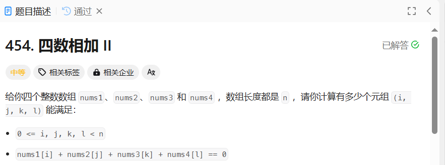
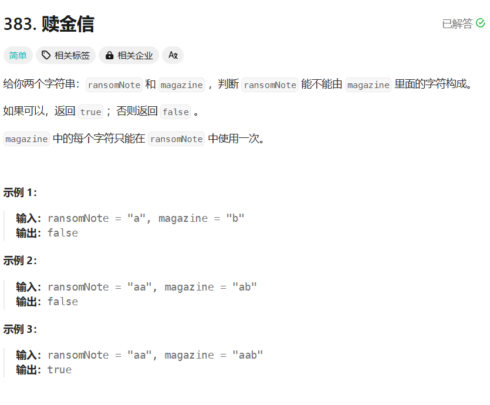
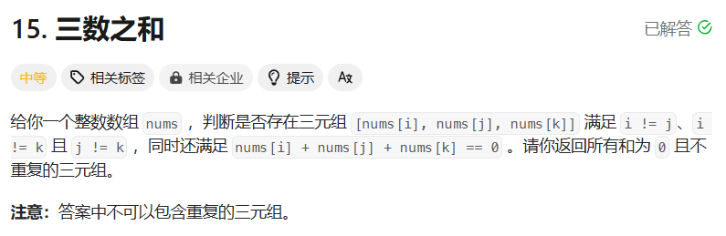
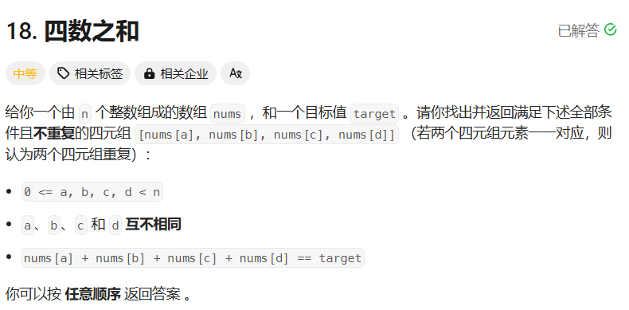

# 哈希表

## 有效的字母异构词


### 哈希表

哈希表不一定非得用函数，可以用计数排序思想。

```c++
class Solution {
public:
    bool isAnagram(string s, string t) {
        int alphabet[26] = {0};
        for(int i = 0; i < s.size(); i++){
            alphabet[s[i] - 'a']++;
        }
        for(int i = 0; i < t.size(); i++){
            if(alphabet[t[i] - 'a'] == 0){
                return false;
            }
            else{
                alphabet[t[i] - 'a']--;
            }
        }
        for(int i = 0 ; i < 26; i++){
            if(alphabet[i] != 0){
                return false;
            }
        }
        return true;
    }
};
```

### 排序

```c++
class Solution {
public:
    bool isAnagram(string s, string t) {
        if(s.size() != t.size()) return false;
        sort(s.begin(), s.end());
        sort(t.begin(), t.end());
        return t == s;
    }
};
```


自己写的代码，虽然是一坨但真不容易：

```c++
class Solution {
public:
    vector<vector<string>> groupAnagrams(vector<string>& strs) {
        //用排序做
        vector<string>sortList; // 排序数组
        vector<vector<string>> res;
        bool flag;
        for(string str : strs){// 遍历输入字符串数组
            string temp = str;
            flag = false; // 判断字符串的异位词是否第一次出现
            sort(temp.begin(), temp.end());// 排序
            for(int i=0; i<sortList.size();i++){
                string sortStr = sortList[i];
                if(sortStr == temp){ // 当从排序数组匹配到异位词时
                    res[i].push_back(str);
                    flag = true;
                }
            }
            if(!flag){ // 若未匹配到异位词
                vector<string> arr;
                arr.push_back(str);
                res.push_back(arr);// 加入一个组
                sortList.push_back(temp);//加入排好的异位词
            }
        }
        return res;
    }
};
```

用HashMap优化上述代码：

```c++
class Solution {
public:
    vector<vector<string>> groupAnagrams(vector<string>& strs) {
        unordered_map<string, vector<string>> sortedMap;
        for(string str : strs){
            string sortedStr = str;
            sort(sortedStr.begin(), sortedStr.end());
            sortedMap[sortedStr].push_back(str);// 有这个下标就直接加入进对应数组，没有就新建下标
        }
        //将map转化为对应格式
        vector<vector<string>> res;
        for(auto pair : sortedMap){
            res.push_back(pair.second);
        }
        return res;
    }
};
```

时间复杂度：O(MKlogK)，M是数组长度，K是单个字符串长度，KlogK是排序用。


变态案例爆时间（排序做法）：

```c++
class Solution {
public:
    vector<int> findAnagrams(string s, string p) {
        vector<int> res;
        string sortedStr = p;
        sort(sortedStr.begin(), sortedStr.end());
        if(p.length() > s.length()) return res;
        for(int i = 0; i < s.length() - p.length() + 1; i++){
            string temp;
            for(int j = 0; j<p.length(); j++){
                temp += s[i+j];
            }
            sort(temp.begin(), temp.end());
            if(temp == sortedStr){
                res.push_back(i);
            }
        }
        return res;
    }
};
```

自己写的计数方法（时间仍然不咋地）：

```c++
class Solution {
public:
    vector<int> findAnagrams(string s, string p) {
        vector<int> res;
        unordered_map<char,int> countMap;
        bool flag;
        if(p.length() > s.length()) return res;
        for(char c : p) countMap[c]++;// 初始化map
        for(int i = 0; i < s.length() - p.length() + 1; i++){
            auto tempMap = countMap;
            flag = true;
            for(int j = 0; j < p.length(); j++){
                if(--tempMap[s[i+j]] < 0) {
                    flag = false;
                    break;
                }
            }
            if(flag) res.push_back(i);
        }
        return res;
    }
};
```

计数方法优化版，只开辟哈希表项不复制整个表

```c++
class Solution {
public:
    vector<int> findAnagrams(string s, string p) {
        vector<int> res;
        unordered_map<char,int> countMap, targetMap;
        int left=0, right = p.size() - 1;
        if(p.length() > s.length()) return res;
        for(int i=0; i < p.length(); i++){
            // 初始化map
            countMap[p[i]]++;
            targetMap[s[i]]++;
        }
        while(right < s.size()){
           if(targetMap == countMap) res.emplace_back(left);
           // 如果targetMap里边有字符已经为0则需删除表项，这段代码可读性极差
           if(!--targetMap[s[left++]]) targetMap.erase(s[left - 1]);
           targetMap[s[++right]]++;
        }
        return res;
    }
};
```

不用哈希表的计数方法（官方题解1）

```c++
class Solution {
public:
    vector<int> findAnagrams(string s, string p) {
        vector<int> res;
        vector<int> pCount(26), sCount(26);
        int left=0, right = p.size() - 1;
        if(p.length() > s.length()) return res;
        for(int i = 0; i < p.size(); i++){
            pCount[p[i]-'a']++;
            sCount[s[i]-'a']++; 
        }
        while(right < s.size() - 1){ //最后一次比较不能放循环里要不然++right超出边界
            if(pCount == sCount) res.emplace_back(left);
            sCount[s[left++]-'a']--;
            sCount[s[++right]-'a']++;
        }
        if(pCount == sCount) res.emplace_back(left);
        return res;
    }
};
```

优化后的滑动窗口，但是有的测试案例bug（**未解决**）

```c++
class Solution {
public:
    vector<int> findAnagrams(string s, string p) {
        vector<int> res;
        vector<int> count(26);
        int differ = 0, curr;
        int left=0, right = p.size() - 1;
        if(p.length() > s.length()) return res;
        for(int i = 0; i < p.size(); i++){
            count[p[i]-'a']++;
            count[s[i]-'a']--;
        }
        for(int i : count) if(i != 0) differ++;
        while(right < s.size() - 1){ //最后一次比较放在循环外
            if(differ == 0) res.emplace_back(left);
            curr = ++count[s[left++]-'a'];
            if(curr == 0) differ--;
            else if(curr > 0) differ++;
            curr = --count[s[++right]-'a'];
            if(curr == 0) differ--;
            else if(curr < 0) differ++;
        }
        if(differ == 0) res.emplace_back(left);
        return res;
    }
};
```

## 两个数组的交集


```c++
class Solution {
public:
    vector<int> intersection(vector<int>& nums1, vector<int>& nums2) {
        unordered_set<int> nums_set(nums1.begin(), nums1.end());
        unordered_set<int> res;
        for(int i : nums2){
            // 这里的find(i)和end()返回的都是迭代器，不是具体的值
            if(nums_set.find(i) != res.end()){
                res.insert(i);
            }
        }
        return vector<int>(res.begin(), res.end());
    }
};
```


```c++
class Solution {
public:
    vector<int> intersect(vector<int>& nums1, vector<int>& nums2) {
        unordered_map<int, int> m;
        vector<int> res;
        for(int num : nums1) m[num]++;
        for(int num : nums2){
            if(m[num]){
                m[num]--;
                res.push_back(num);
            }
        }
        return res;
    }
};
```

问老肖，为什么不能这么写 已解决

```cpp
class Solution {
public:
    vector<int> intersect(vector<int>& nums1, vector<int>& nums2) {
        unordered_multiset<int>nums_set(nums1.begin(), nums1.end());
        unordered_multiset<int>res;
        for(int num : nums2){
            if(nums_set.count(num)){
                res.insert(num);
                nums_set.erase(num);// erase会删除所有的重复项
            }
        }
        return vector<int>(res.begin(), res.end());
    }
};
```


## 快乐数


### 哈希表

自己的大粪哈希表写法：

```c++
class Solution {
public:
    bool isHappy(int n) {
        unordered_set<int> numList;
        int temp;
        string k = to_string(n);
        numList.insert(n);
        while(k != "1"){
            temp = 0;
            for(char i : k) temp+=(i-'0')*(i-'0');
            k=to_string(temp);
            if(numList.count(temp)) return false;
            numList.insert(temp);
        }
        return true;
    }
};
```

### 快慢指针

```c++
class Solution {
public:
    bool isHappy(int n) {
        // 快慢指针，只要涉及到循环链表（不管是隐式还是显式）都可以用
        int slow = n, fast = n;
        if(getNext(n) == 1) return true;
        while(fast != 1){
            slow = getNext(slow);
            fast = getNext(getNext(fast));
            if(slow == fast) return false;
        }
        return true;
    }

    int getNext(int n){
        int res = 0;
        while(n>0){
            int d = n % 10;
            n = n / 10;
            res += d*d;
        }
        return res;
    }
};
```


### 哈希表

时间复杂度和空间复杂度都是O(n)

```c++
class Solution {
public:
    vector<int> twoSum(vector<int>& nums, int target) {
        // 当需要判断一个元素是否第一次出现，或者一个元素是否在一个集合中，要考虑哈希表
        // 这里的key是数组元素，value是数组元素下标
        unordered_map<int, int> countList;
        for(int i = 0; i < nums.size(); i++){
            int temp = target - nums[i];
            auto iter = countList.find(temp);
            if(iter != countList.end()){//这里不用count的原因是要找到对应下标
                return {i, iter->second};
            }
            countList.insert(pair<int, int>(nums[i], i));
        }
        return {};
    }
};
```

## 四数相加 II



问老肖，为什么p和q都是迭代器但返回second的方式不同 p是pair，q的pair的迭代器要用指针

```c++
class Solution {
public:
    int fourSumCount(vector<int>& nums1, vector<int>& nums2, vector<int>& nums3, vector<int>& nums4) {
        int sum = 0;
        unordered_map<int,int> fmap,lmap;
        int n = nums1.size();
        for(int i=0; i < n; i++){
            for(int j = 0; j < n; j++){
                // key是和，value是出现次数
                fmap[nums1[i]+nums2[j]]++;
                lmap[nums3[i]+nums4[j]]++;
            }
        }
        /*
        for(auto p : fmap){
            auto q = lmap.find(-p.first);
            if(q != lmap.end()) sum += p.second * q->second;
        }
        */
        // 老肖改进版：
        for(auto [a, b] : fmap){
            if(lmap.count(-a)) sum += b * lmap[-a];
        }
        return sum;
    }
};
```

## 赎金信



```c++
class Solution {
public:
    bool canConstruct(string ransomNote, string magazine) {
        unordered_map <char, int>lmap;
        for(char r : magazine) lmap[r]++;
        for(char r : ransomNote){
            auto iter = lmap.find(r);
            if(iter == lmap.end() || --lmap[r] < 0) return false;
            // else if(--lmap[r] < 0) return false;
        }
        return true;
    }
};
```

## 三数之和



**这道题重看吧，照着答案抄都抄不明白**

### 双指针

```c++
class Solution {
public:
    vector<vector<int>> threeSum(vector<int>& nums) {
        // 这道题哈希表去重太麻烦，而且时间容易超，用双指针
        vector<vector<int>> res;
        // 先排序
        sort(nums.begin(), nums.end());
        for(int i = 0; i < nums.size() - 2; i++){
            if(nums[i] > 0) break; // 排好序之后当前i大于0则三个数不可能等于0
            if(i > 0 && nums[i] == nums[i - 1]) continue; // 向前去重，若是nums[i] == nums[i+1]则可能会遗漏0,0,0或者-1,-1,2这种情况
            int left = i + 1, right = nums.size() - 1;
            while(left < right){
                if(nums[i] + nums[left] + nums[right] < 0) ++left;
                else if(nums[i] + nums[left] + nums[right] > 0) --right;
                else {
                    res.push_back({nums[i], nums[left], nums[right]});
                    // 先找到答案，再去重
                    while(left < right && nums[left + 1] == nums[left]) left++;
                    while(left < right && nums[right - 1] == nums[right]) right--;

                    // 在找到答案后，向内收缩
                    left++;
                    right--;
                }
            }
        }
        return res;
    }
};
```

## 四数之和



```c++
class Solution {
public:
    vector<vector<int>> fourSum(vector<int>& nums, int target) {
        // 与三数之和类似，双指针法，将o(n^4)降为O(n^3)
        vector<vector<int>> res;
        sort(nums.begin(), nums.end());
        for(int i = 0; i < nums.size(); i++){
            // 注意这里的break不能只有nums[i] > target作为条件，因为负数越加越小
            if(nums[i] > target && nums[i] >= 0) break;
            // 一级剪枝
            if(i > 0 && nums[i] == nums[i - 1]) continue;
            // 多套一层循环
            for(int j = i + 1; j < nums.size(); j++){
                if(nums[i] + nums[j] > target && nums[i] + nums[j] >= 0) break;
                // 二级剪枝
                if(j > i + 1 && nums[j] == nums[j - 1]) continue;
                int left = j + 1, right = nums.size() - 1;
                while(left < right){
                    // 注意这里加了一个long防止int加和溢出
                    if((long) nums[left] + nums[right] + nums[i] + nums[j] < target) left++;
                    else if((long) nums[left] + nums[right] + nums[i] + nums[j] > target) right--;
                    else{
                        res.push_back({nums[i], nums[j], nums[left], nums[right]});
                        while(left < right && nums[left] == nums[left + 1]) left++;
                        while(left < right && nums[right] == nums[right - 1]) right--;
                        left++;
                        right--;
                    }
                }
            }
        }
        return res;
    }
};
```

