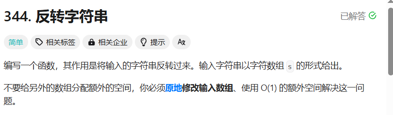
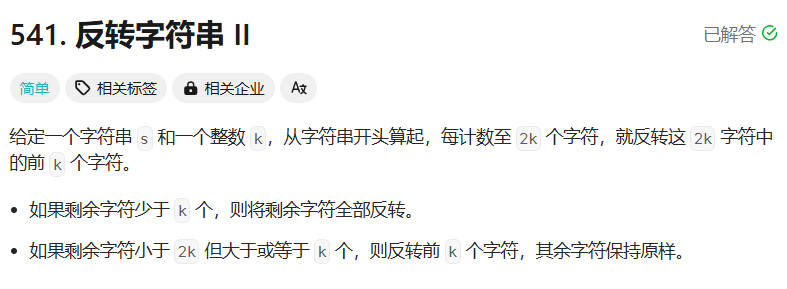
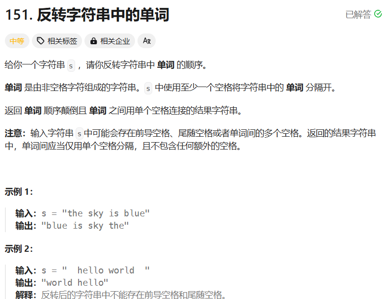
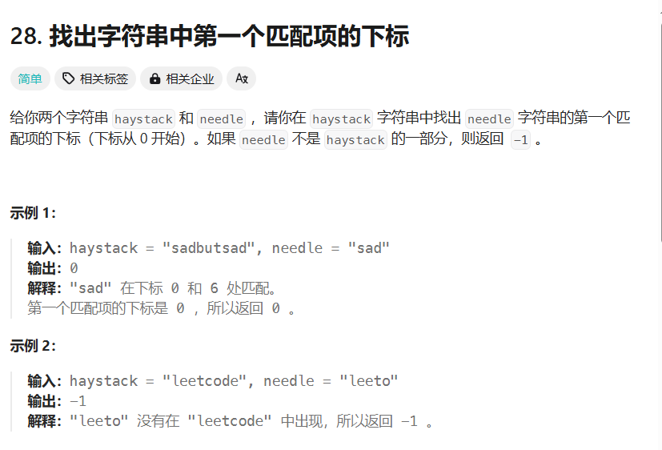
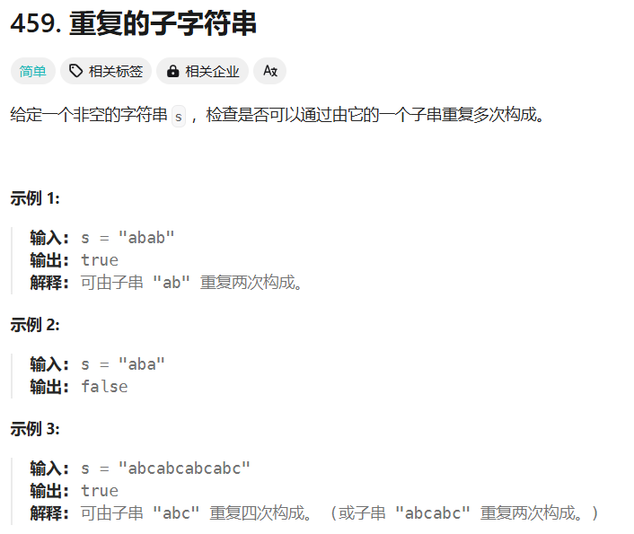

# 字符串

## 反转字符串



```c++
class Solution {
public:
    void reverseString(vector<char>& s) {
        int left = 0, right = s.size() - 1;
        while(left < right){
            char c = s[left];
            s[left] = s[right];
            s[right] = c;
            left++, right--;
        }
        return;
    }
};
```

## 反转字符串II



```c++
class Solution {
public:
    string reverseStr(string s, int k) {
        for(int i = 0; i < s.length(); i+=2*k){
            if(i + k > s.length()) reverse(s, i, s.length() - 1);
            else reverse(s, i, i+k - 1);
        }
        return s;
    }
    void reverse(string& s, int left, int right){
        while(left < right){
            char c = s[left];
            s[left] = s[right];
            s[right] = c;
            left++, right--;
        }
    }
};
```

## 反转字符串中的单词



### 拆分再倒转法

```c++
class Solution {
public:
    string reverseWords(string s) {
       vector<string> wordList;
       string word;
       string sentence;
       // 注意当最后一个单词打进word后若没有空格则无法触发else if条件，也就是无法录入wordList。
       s+=' ';
       for(char c : s){
            if(!isspace(c)) word += c;
            else if(!word.empty()){
                wordList.push_back(word);
                word.clear();
            }
       }
       // reverse(wordList.begin(), wordList.end());
       int left = 0; int right = wordList.size() - 1;
       while(left < right){
        string temp = wordList[left];
        wordList[left] = wordList[right];
        wordList[right] = temp;
        left++;
        right--;
       }
       
       for(int i = 0; i < wordList.size(); i++){
        if(i == 0) sentence += wordList[i];
        else sentence += ' ' + wordList[i];
       }
        return sentence;
    }
};
```

时间空间复杂度均为O(n)

### 双指针法

我自己写的，给老肖看哪不对

```cpp
class Solution {
public:
    void removeExtraSpace(string &s){
        // 快慢指针
        int left = 0, right = 0;
        for(; right < s.size(); right++){
            if(isspace(s[right])){
                if(right != 0 && !isspace(s[right + 1])) s[left++] = s[right];
            }
            else s[left++] = s[right];
        }
        s.resize(left);// 截断字符串
    }
    // 空间复杂度为O(1)的两次逆置法
    string reverseWords(string s) {
        // 将多余空格删除
        removeExtraSpace(s);
        reverse(s.begin(), s.end());
        int left = 0;
        for(int right = 0; right < s.size(); right++){
            if(isspace(s[right])) {
                reverse(s.begin() + left, s.begin() + right);
                left = right + 1;
            }
        }
        // 逆置最后一个单词
        reverse(s.begin() + left, s.end());
        return s;
    }
};
```

删除空格好难，官方解法，回头再看看

```cpp
class Solution {
public:
    void removeExtraSpace(string &s){
        // 快慢指针，删除所有空格，再补空格
        int left = 0, right = 0;
        for(; right < s.size(); right++){
            if(!isspace(s[right])){
                if(left != 0) s[left++] = ' ';// 当不是第一个单词时，补一个空格
                // 一个单词一个单词向前挪
                while(right < s.size() && !isspace(s[right])){
                    s[left++] = s[right++];
                }
            }
        }
        s.resize(left);// 截断字符串
    }
    // 空间复杂度为O(1)的两次逆置法
    string reverseWords(string s) {
        // 将多余空格删除
        removeExtraSpace(s);
        reverse(s.begin(), s.end());
        int left = 0;
        for(int right = 0; right < s.size(); right++){
            if(isspace(s[right])) {
                reverse(s.begin() + left, s.begin() + right);
                left = right + 1;
            }
        }
        // 逆置最后一个单词
        reverse(s.begin() + left, s.end());
        return s;
    }
};
```

## KMP



做了俩点抄都抄不明白，先保留

紫砂了，看了两天看不明白，问老肖

https://leetcode.cn/problems/find-the-index-of-the-first-occurrence-in-a-string/solutions/2600821/kan-bu-dong-ni-da-wo-kmp-suan-fa-chao-qi-z1y0

```cPP
class Solution {
public:
    void get_next(vector<int>& next, string p){
        /*
            最长公共前后缀写法
            next[j]本质是needle[0,...,j-1]的最长公共前后缀
            假设现在要求next[j]，next[j-1]已经求完了:
            令i = next[j-1]，求next[j]的核心是求needle[j-1]，要求needle[j-1]+next[j-1]对应的后缀是否等于needle[i] + next[i]对应的前缀，故必须要用到next[j-1]和i。由于next[j-1]和next[i]前后缀是相等的，故仅需比较needle[j-1]和needle[i]即可。
            若上面两字符一样则直接进入下一轮；若不相等则需缩短前后缀：
            由于next[i]对应前后缀不能满足上述条件，故需要针对needle[0,...,next[i]]寻找最长公共前后缀，令i'=next[i]。这块没有图实在不好理解。判断needle[i']是否等于needle[j-1]，若相等则进入下一轮循环，若不相等再令i''=next[i']...直至匹配成功。
            若一直匹配失败，最终i会为0。

            王道书上的next数组是将最长公共前后缀的next数组整体左移（并令next[0]=-1）再加1得到（这样next[0]就为0了）。
        */
        int n = p.size();
        next.assign(n+1, 0); // 令next数组为0
        for(int j = 2, i = 0; j < n + 1;j++){//初始化i为0
            while(p[j - 1] != p[i] && i > 0) i = next[i];//这里的i > 0 意思是若i已经找到0号位置，则跳出循环，无公共最长前后缀
            if(p[i] == p[j - 1]) i++; // 如果i和j-1指向的元素相同，即找到最长公共前后缀，相比于前一个子串的最长公共前后缀多加了1
            next[j] = i;
        }
    };
    int strStr(string haystack, string needle) {
        vector<int> next, res;
        get_next(next, needle);
        for(int i = 0, j = 0; i < haystack.size(); i++){
            // i不需要回溯
            while(haystack[i] != needle[j] && j > 0) j = next[j];
            if(haystack[i] == needle[j]) j++; // 匹配成功时，j也向前走
            if(j == needle.size()) { // 如果找到了一个匹配的位置
                res.push_back(i - j + 1); // 记录结果
                j = next[j]; // 看不懂思密达
            }
        }
        if(res.size() > 0) return res[0];
        return -1;
    }
};
```

## 重复子字符串



### 暴力解法

完犊子了，暴力解法也是抄的

```cpp
class Solution {
public:
    bool repeatedSubstringPattern(string s) {
        int n = s.size();
        for(int i = 1; i * 2 <= n; i++){ // 只需要循环前n/2个就行
            bool flag = true;
            if(n % i != 0) continue;
            for(int j = i; j < n; j++){
                if(s[j - i] != s[j]){// 这里很巧妙地用了j-i实现遍历i的效果
                    flag = false;
                    break;
                } 
            }
            if(flag) return true;
        }
        return false;
    }
};
```

### 移动匹配

造化钟神秀

```cpp
class Solution {
public:
    bool repeatedSubstringPattern(string s) {
        string t = s + s;
        t.erase(t.begin());
        t.erase(t.end() - 1); // 注意去尾写法
        if(t.find(s) != std::string::npos) return true; // 当没有找到时，t.find(s) == std::string::npos
        return false;
        // 或者：从下标为1开始查找，并且查找的位置不能为s最后一个元素的下一个元素的位置，也可以实现掐头去尾的效果
        // return (s + s).find(s, 1) != s.size();
    }
};
```

