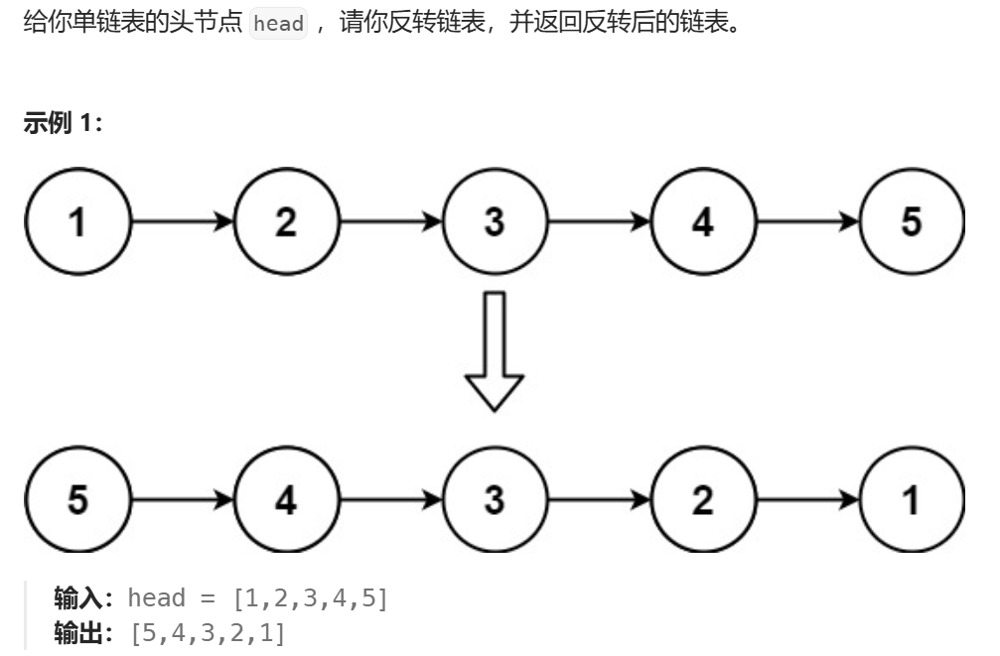

# 5_双指针法

## 移除元素


两种方法

```cpp
class Solution {
public:
    int removeElement(vector<int>& nums, int val) {
        // 快慢指针法
        // int left=0, right=0;
        // for(;right<nums.size();right++){
        //     if(val != nums[right]){
        //         nums[left] = nums[right];
        //         left++;
        //     }
        // }
        // 两端指针法
        int left=0, right=nums.size()-1;
        while(left <= right){
            if(val == nums[left]){
                while(nums[right] == val) right--;
                nums[left] = nums[right];
                right--;
            }
            left++;
        }
        return left;
    }
};
```

## 替换数字


```cpp
#include<iostream>
#include<string>
using namespace std;

void repalceNumber(string &str){
    // 两次循环，第一次判断到底有多长，第二次从后往前覆盖
    int n = 0, strLen = str.size();
    string num = "number";
    for(char c : str){
        if(c >= '0' && c <= '9'){
            n++;
        }
    }
    while(n!=0){
        str += "     ";
        n--;
    }
    for(int left = strLen - 1, right = str.size() - 1; left >= 0;left--){ // 左闭右闭
        if(str[left] <= '9' && str[left] >= '0'){
            for(int j = 6; j > 0; j--){
                str[right - 6 + j] = num[j - 1];
            }
            right -= 6;
        }
        else str[right--] = str[left];
    }
}

int main(){
    string s;
   while(cin >> s){
       repalceNumber(s);
       cout << s << endl;
   }
   return 0; 
}
```

## 翻转字符串中的单词


我写的比官方优雅：

```cpp
class Solution {
public:
    void deleteExtraSpace(string &s){
        // 双指针法
        int left = 0, right = 0;
        for(; right < s.size(); right++){
            if(isspace(s[right])){
                // 若为第一个单词前面的空格
                if(left == 0) continue;
                // 若为单词之间的多余空格
                else if(right + 1 != s.size() && isspace(s[right + 1])) continue;
                // 若为最后一个单词之后的最后一个空格
                else if(isspace(s[right]) && right + 1 == s.size()) break;
                // 其余情况是正常的空格
                else s[left++] = s[right];
            }
            // 非空格直接覆盖
            else s[left++] = s[right];
        }
        s.resize(left);
    }
    string reverseWords(string s) {
        deleteExtraSpace(s);
        reverse(s.begin(), s.end());
        int len = 0;
        // 双指针法
        int left = 0, right = 0;
        for(; right < s.size(); right++){
            if(isspace(s[right])){
                reverse(s.begin() + left, s.begin() + right);
                left = right + 1;
            }
        }
        // 差最后一个单词每逆转
        reverse(s.begin() + left, s.end());
        return s;
    }
};
```

## 右旋字符串


```cpp
#include<iostream>
#include<string>
#include<algorithm>
using namespace std;

void rightRotateStr(int k, string &str){
    // 空间复杂度O（1）写法
    reverse(str.begin(), str.end());
    reverse(str.begin(), str.begin() + k);
    reverse(str.begin() + k, str.end());
}   

int main(){
    int k;
    string str;
    cin>>k;
    cin>>str;
    rightRotateStr(k ,str);
    cout << str << endl;
    
    return 0;
}
```

## 翻转链表



### 双指针法

```cpp
/**
 * Definition for singly-linked list.
 * struct ListNode {
 *     int val;
 *     ListNode *next;
 *     ListNode() : val(0), next(nullptr) {}
 *     ListNode(int x) : val(x), next(nullptr) {}
 *     ListNode(int x, ListNode *next) : val(x), next(next) {}
 * };
 */
class Solution {
public:
    ListNode* reverseList(ListNode* head) {
        if(!head) return head;
        ListNode* left = nullptr, * right = head;
        ListNode* temp = right->next;
        while(right != nullptr){
            temp = right->next;
            right->next = left;
            left = right;
            right = temp;
        }
        return left;
    }
};
```

